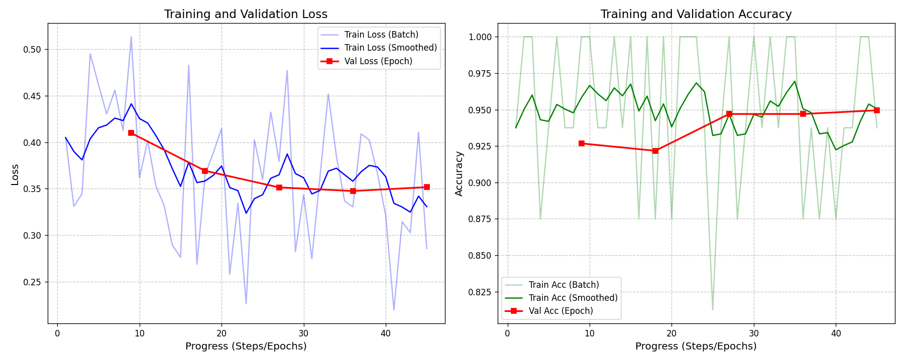
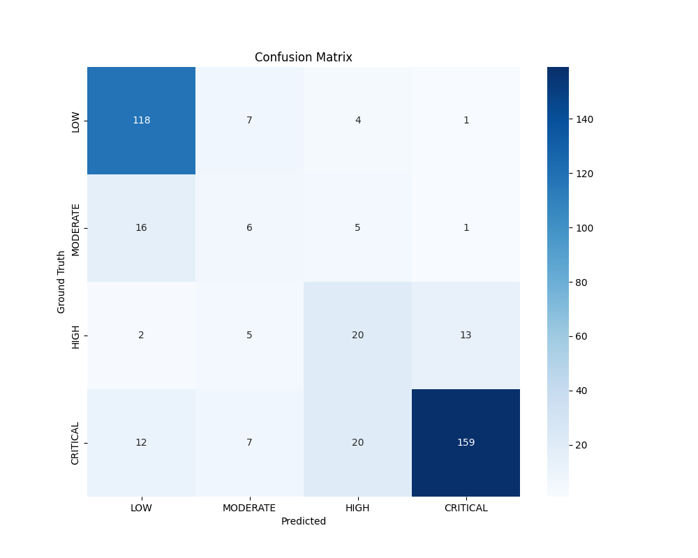

# Pothole Risk Prediction System

A Multi-Modal Deep Learning system designed to estimate the risk of pothole formation by integrating visual analysis of road surfaces with environmental context such as weather conditions and traffic load.

## Features

- Visual Analysis: Utilizes a ResNet18 Convolutional Neural Network (CNN) to detect existing road damage and surface fatigue.
- Environmental Context: Incorporates atmospheric conditions (Weather) and traffic intensity into the risk estimation logic.
- Automated Weather Detection: Includes a heuristic-based classifier to estimate weather conditions (Sunny, Rainy, Snowy) directly from input imagery.
- Risk Assessment: Generates a numerical risk score and classifies the severity into one of four levels: Low, Moderate, High, or Critical.

## Installation and Setup

1.  Initialize Virtual Environment:

    ```bash
    python3 -m venv venv
    source venv/bin/activate
    ```

2.  Install Required Packages:

    ```bash
    pip install -r requirements.txt
    ```

3.  Acquire Dataset (For Training):
    The model utilizes the RDD2022 (China_MotorBike) subset for training.
    - Automated Setup:
      Run the following command to initialize directories and receive specific instructions:

      ```bash
      python3 -m src.setup_data
      ```

    - Manual Download:
      1. Download the dataset archive: [RDD2022_China_MotorBike.zip](https://bigdatacup.s3.ap-northeast-1.amazonaws.com/2022/CRDDC2022/RDD2022/Country_Specific_Data_CRDDC2022/RDD2022_China_MotorBike.zip)
      2. Extract archives into the `data/raw/China_MotorBike/` directory.
      3. Ensure the final structure adheres to the standard train/test partitioning with associated images and annotations.

## Usage Instructions

### General Workflow

A helper script is provided to manage training (if model weights are absent) and run a demonstration:

```bash
./run.sh
```

### Command Line Inference

To perform analysis on a specific image:

```bash
# Standard inference (automatic weather detection)
python3 -m src.inference --image path/to/image.jpg

# Simulated inference (manually specified conditions)
python3 -m src.inference --image path/to/image.jpg --weather Rainy --traffic High
```

### Model Evaluation

The system includes built-in tools for performance visualization:

1. **Training Progress**: To train the model and generate accuracy/loss graphs:

   ```bash
   python3 -m src.train
   ```

   Graphs are saved to `metrics/loss_accuracy.png`.

2. **Confusion Matrix**: To evaluate the trained model:
   ```bash
   python3 -m src.evaluate
   ```
   Confusion matrix and precision/recall reports are saved to `metrics/confusion_matrix.png`.

## 📈 Model Performance

The following graphs show the training progress and classification performance of the model on the RDD2022 dataset.

### Training Progress (Accuracy & Loss)



### Confusion Matrix



### Classification Report

| Category            | Precision | Recall   | F1-Score | Support |
| :------------------ | :-------- | :------- | :------- | :------ |
| **LOW**             | 0.82      | 0.65     | 0.72     | 130     |
| **MODERATE**        | 0.23      | 0.43     | 0.30     | 28      |
| **HIGH**            | 0.18      | 0.38     | 0.25     | 40      |
| **CRITICAL**        | 0.84      | 0.67     | 0.75     | 198     |
| **Average / Total** | **0.72**  | **0.62** | **0.66** | **396** |

### Technical Specifications

| Feature           | Details                                       |
| :---------------- | :-------------------------------------------- |
| **Smoothing**     | Exponential Moving Average (factor: 0.8)      |
| **Activation**    | ReLU (hidden layers) & Sigmoid (output layer) |
| **Architecture**  | ResNet18 + MLP Fusion Head                    |
| **Loss Function** | BCELoss (Binary Cross Entropy)                |
| **Evaluation**    | Precision, Recall, F1-Score, and Support      |

### REST API Service

The system can be deployed as a background service using FastAPI:

```bash
python3 -m src.api
```

The API exposes a POST `/predict` endpoint for remote risk assessment.

## Technical Methodology

1.  Visual Encoder: Features are extracted from input images to identify patterns indicative of structural decay.
2.  Metadata Encoder: Environmental parameters are processed through a dense neural network.
3.  Fusion and Prediction: The system fuses visual and environmental features to calculate a risk score. Environmental factors act as multipliers on the base visual risk to account for accelerated decay in harsh conditions.

## Project Structure

- src/model.py: Neural Network architecture definitions.
- src/inference.py: Main prediction logic and weather detection heuristics.
- src/api.py: REST API implementation.
- src/train.py: Training and validation routines.
- src/data_generator.py: Logic for environmental simulation and risk scoring.
- src/setup_data.py: Utility for data directory initialization.
